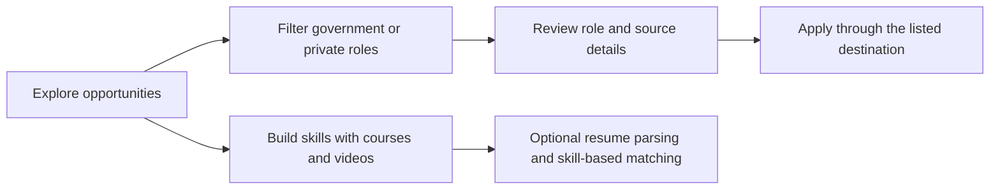
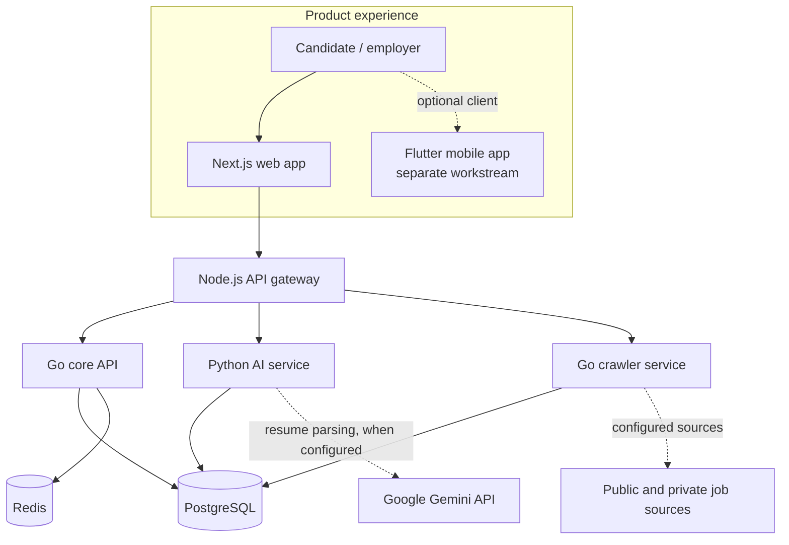

# RojgarSetu 2.0

### Career discovery for India's public and private job markets

RojgarSetu brings job discovery, career learning and recruitment workflows into one platform: candidates can explore government and private-sector opportunities, while employers can publish roles and manage candidate activity. The codebase combines a web application with API, data-ingestion and recommendation services.

> **Project status:** This repository contains product source code and local deployment definitions, not evidence of a currently operated production service. Provider availability, live data, deployment, security posture and operational readiness must be verified for the buyer's intended use. This README deliberately makes no uptime, catalogue-size, latency or production-readiness guarantee.

<p>
  
  
  
  
  
</p>

**In one sentence:** a career platform for discovering opportunities and learning resources, supported by a modular backend and configurable data providers.

## At a glance

| For candidates | For employers | For platform operators |
| --- | --- | --- |
| Browse government and private jobs; explore courses and interview-preparation videos; create a candidate account and profile. | Create an employer account, publish roles and use company-facing dashboard/application workflows present in the product. | Operate API, crawler and AI services alongside PostgreSQL and Redis; configure integrations through environment variables. |

### Candidate journey



The diagram describes the product intent, not a guarantee that every source, listing, application flow or external provider is live in every deployment.

## Product capabilities

| Area | What the repository provides | Important boundary |
| --- | --- | --- |
| Job discovery | Separate government and private-job experiences, search/filter APIs and database-backed records. | Listings depend on configured sources and ingestion health. Check deadlines and apply at the employer or official portal. |
| Candidate and employer workflows | Registration/login, candidate and company profile handlers, job publishing and application-related APIs/UI. | Validate the complete identity, authorization and application lifecycle against the target deployment before launch. |
| Career learning | Course and video resource pages and API handlers. | Provider feeds, availability and content rights can change; the repository does not guarantee a particular catalogue. |
| Resume assistance | FastAPI resume parsing can use Google Gemini and has a basic rule-based parsing fallback. | Resume text is sensitive personal data. Review provider terms, consent, retention and regional privacy requirements before enabling it. |
| Job matching | Skill and keyword overlap scoring, with a location preference adjustment. | This is transparent heuristic matching, not a trained or independently validated machine-learning ranking model. |
| Ingestion | Go crawler service, scheduled work, browser automation and persistence/deduplication paths. | Source sites can change or restrict automated access. Configure, monitor and validate each source; do not assume freshness. |

## How the system fits together

The default Compose stack defines the web frontend, Node.js API gateway, Go API, Python AI service, Go crawler, PostgreSQL and Redis. The Java authentication service exists in the repository but is commented out in the default Compose file; confirm the intended auth ownership and gateway routing before a production deployment.



### Main components

| Component | Technology | Responsibility |
| --- | --- | --- |
| Web app | Next.js 16, React 19, Tailwind CSS | Public discovery, candidate/employer screens, courses and videos. |
| API gateway | Node.js 22, Express | HTTP entry point and service proxy/configuration layer. |
| Core API | Go 1.26, Gin | Accounts, jobs, applications, courses, videos, search and related APIs; PostgreSQL migrations and Swagger documentation. |
| AI service | Python 3.11, FastAPI | Resume parsing and heuristic job matching; Gemini credential required by the current service startup configuration. |
| Crawler | Go 1.26, Playwright | Scheduled source ingestion and persistence. |
| Data services | PostgreSQL 16, Redis 7 | Relational records and cache/service support. |
| Mobile app | Flutter | Separate codebase in `mobile_app_flutter/`; not part of the default Compose deployment and not represented here as release-ready. |

## Run the default stack locally

### Requirements

- Docker Desktop or Docker Engine with the Compose plugin
- A Google Gemini API key for the current AI-service configuration
- Provider credentials only for integrations you choose to enable

For local development of individual services, see their manifests: [frontend](frontend/package.json), [Go API](backend_go/go.mod), [crawler](services/crawler-go/go.mod), [AI service](services/ai-engine-python/requirements.txt) and [gateway](services/api-gateway-node/package.json).

### 1. Create a private local environment file

From the repository root, copy the template and fill required values **locally**. Do not paste secrets into this README, source files, screenshots, issues or commits.

PowerShell:

```powershell
Copy-Item .env.example .env
```

macOS/Linux/Git Bash:

```bash
cp .env.example .env
```

Use [`.env.example`](.env.example) as the variable-name checklist. The template contains placeholders, not working credentials. Supply strong unique secrets and valid provider credentials in your local `.env`; do not reuse example values in a deployed environment. Local `.env` files are excluded by the repository's ignore rules. Review [production.env.example](production.env.example) before preparing a deployment.

### 2. Build and start

```bash
docker compose up --build -d
docker compose ps
```

Open the local endpoints:

| Service | Local URL |
| --- | --- |
| Web application | [http://localhost:8080](http://localhost:8080) |
| API gateway | [http://localhost:3001](http://localhost:3001) |
| Go API | [http://localhost:8083](http://localhost:8083) |
| AI service | [http://localhost:8000](http://localhost:8000) |
| Crawler | [http://localhost:8082](http://localhost:8082) |
| PostgreSQL | `localhost:5435` |
| Redis | `localhost:6380` |
| Go API health | [http://localhost:8083/health](http://localhost:8083/health) |
| Go API Swagger UI | [http://localhost:8083/docs/index.html](http://localhost:8083/docs/index.html) |

The first boot builds images and the Go API applies its database migrations. External-source data is not guaranteed to be seeded or immediately available. For local metrics, the Compose `monitoring` profile adds Prometheus and Grafana; set their credentials locally before enabling it.

```bash
docker compose --profile monitoring up --build -d
```

To stop the stack without removing persisted database volumes:

```bash
docker compose down
```

## API and integration entry points

The Go API's generated Swagger UI is available at `/docs/index.html` when the backend is running. The checked-in OpenAPI/Swagger artifacts are in [`backend_go/docs/`](backend_go/docs/).

| Capability | Service | Example route family |
| --- | --- | --- |
| Authentication and profiles | Go API | `/api/v1/auth`, candidate and company routes |
| Government and private jobs | Go API | `/api/v1/gov-jobs`, `/api/v1/priv-jobs` |
| Search and categories | Go API | `/api/v1/search`, `/api/v1/categories` |
| Courses and videos | Go API | `/api/v1/courses`, `/api/v1/videos` |
| Resume parsing and recommendations | AI service | `/parse-resume`, `/recommend/jobs` |
| Health checks | Services | `/health` where implemented |

Routes may be rewritten or protected by the gateway; use the running Swagger definition and deployed gateway configuration as the contract of record.

## Verification and release confidence

The repository includes Go tests and GitHub Actions workflows for backend/crawler checks, frontend type-check/build steps, an AI import smoke check, Docker builds and a non-blocking Trivy filesystem vulnerability scan. Coverage is not uniform across every component, and a successful CI run is not equivalent to a production acceptance, security or availability certification.

Before relying on this system with real users, independently verify at minimum:

- End-to-end registration, login, permissions, logout and account persistence through the deployed gateway.
- Each configured source's legal access, extraction accuracy, freshness, deduplication and official application link.
- AI-provider consent, data processing, cost controls, failure behavior and output quality.
- Database backups/restores, monitoring/alerts, secrets rotation, TLS, ingress restrictions and incident response.
- The actual release/deployment procedure. The current `prod-ci-cd` workflow's deploy step is a placeholder; it does not perform a production-server rollout.

Useful focused checks:

```bash
cd backend_go
go test ./...
go test ./tests/...
```

```bash
cd frontend
npm install --legacy-peer-deps
npm run type-check
npm run build
```

Check the workflow definitions before relying on a particular test, scanner or deployment gate: [CI workflow](.github/workflows/ci.yml) and [production workflow](.github/workflows/prod-ci-cd.yml).

## Trust, privacy and operational boundaries

- **Source data:** Listings and notices can become stale. Confirm the source, eligibility, dates, fees and application instructions at the original employer or official portal. RojgarSetu is a discovery layer, not the issuing authority.
- **No fee claims:** The platform should not be presented as collecting recruitment/application fees on behalf of listed sources. Verify any payment or third-party flow separately.
- **AI and personal data:** Resume content can include sensitive personal information. Obtain appropriate consent and assess provider processing, retention and applicable privacy obligations before sending it to an external AI provider.
- **Security:** The codebase includes controls such as environment-configured signing keys, cookie/CSRF and rate-limit code paths, database migrations and non-root container builds. These are implementation details, not an independent audit or guarantee. The default Compose file also publishes service ports for local development; production ingress should expose only what is required.
- **Secrets:** Never commit `.env` or real API keys, passwords, tokens, private keys or database URLs. If a credential is exposed, revoke/rotate it and report it privately using [SECURITY.md](SECURITY.md).
- **Visible counters:** Some homepage figures are static UI values rather than a verified, audited live supply metric. Do not use them as buyer-facing catalogue or adoption evidence without replacing them with measured data.
- **Mobile:** The Flutter directory is a separate workstream and is not started by the root Compose stack.

## Repository map

```text
backend_go/                 Go API, migrations, handlers, tests and Swagger artifacts
services/api-gateway-node/  Node.js API gateway
services/ai-engine-python/  FastAPI resume and matching service
services/crawler-go/        Go crawler and scheduler
frontend/                   Next.js web application
mobile_app_flutter/         Separate Flutter application
database/                   Database schema references
deployment/                 Deployment and Nginx configuration
monitoring/                 Prometheus, Grafana and logging configuration
docs/ops/                   Operational runbooks
docs/reports/               Project status and analysis documents
```

## License and commercial evaluation

This repository is **not licensed under MIT**. The checked-in [LICENSE](LICENSE) is a proprietary EULA: it grants limited free, non-commercial evaluation use, while commercial/production use and restricted modules require prior written permission or a separate agreement. Obtain written licensing and IP confirmation before acquisition, redistribution, hosting or production use.

## Security and diligence

For vulnerability reports, follow [SECURITY.md](SECURITY.md) and do not publish credentials or exploit details in a public issue. For buyer diligence, treat this README as an architecture and capability guide; validate the current branch, data rights, live integrations, deployment ownership and commercial terms directly against the code and maintainers.
